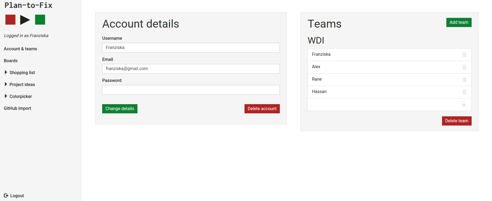

# plantofix
Project 2 WDI14 LDN - Task planning tool

### How to use it

Please sign-up for the app to be able to start using it. After login you see all your boards.

Clicking on a board let's you see the lists with all the taks on it.

Tasks can be sorted and moved between lists. They can be easily edited and if you want, you can even add extensive notes to a task.
If you fancy a colorful board you can give a color to each of the tasks via a colorpicker. 

If you want to work together with other users on a board you can create teams of users and create a new board for that team. You can always delete or add team members afterwards.

You can also import issues including their description and label color from any public GitHub repository.

---

### Techniques used
* **Database:** The app is build on postgresql. The current version is completely AJAX free. It only uses submitting forms to update the database.

* **Front-end framework:** Bootstrap is leveraged for basic styling but many pieces also require a lot of custom scss, e.g. landing page.

* **Authentication:** The current version is build entirely with BCrypt for authentification as no distinct roles where required.

* **Other GEMs:** 
A gem is used to get a bootstrap compatible colorpicker. 
The GitHub API gem allows easy access to the GitHub data.

---

