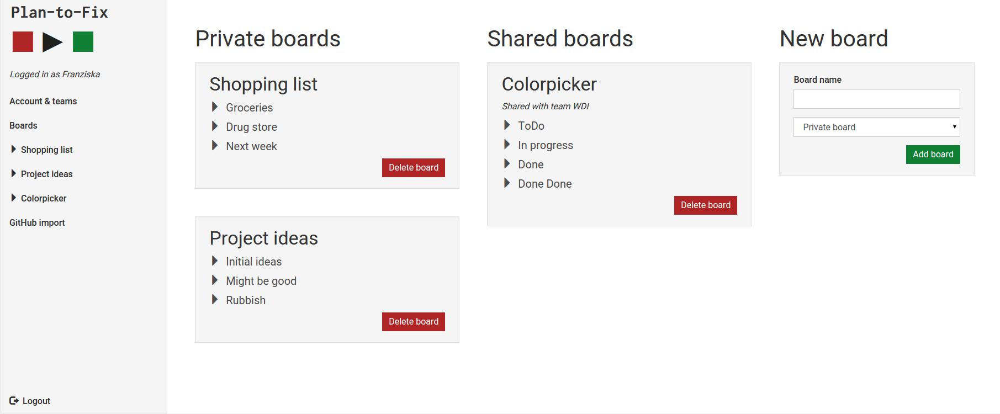
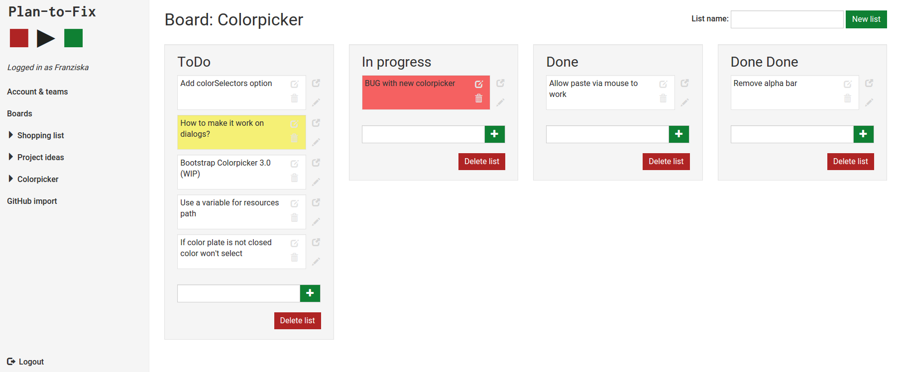
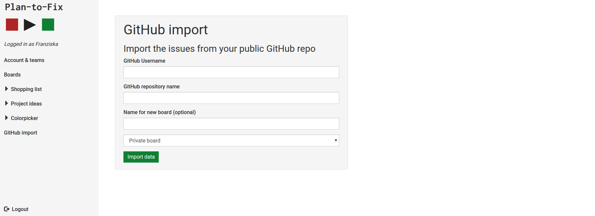

# plantofix
Project 2 WDI14 LDN - Task planning tool

### How to use the app

Go to the [website](plantofix.herokuapp.com) and sign-up for the app to be able to start using it. After login you see all your boards.

Clicking on a board let's you see the lists with all the taks on it.

Tasks can be sorted and moved between lists. They can be easily edited and if you want, you can even add extensive notes to a task.
A couple of preset colors from green to red can be choosen for the tasks to indicate importance or what you are allowed to do first.

If you want to work together with other users on a board you can create teams of users and create a new board for that team. You can always delete or add team members afterwards.

You can also import issues including their description and label color from any public GitHub repository.

---

### How it was made
* **Database:** The app is build on postgreSQL. Updates of tasks are send to the controller via AJAX so no page refresh is required during editing a task, adding a new one and changing the color.

* **Front-end framework:** Twitter Bootstrap 3 is leveraged for basic styling, resposiveness and effects like the modal. Many pieces neverless required a lot of custom scss, e.g. landing page and small inline buttons.

* **Authentication:** The current version is build entirely with BCrypt for authentification as no distinct roles where required.

* **Additional GEMs:** 
    * The key functionality of sorting tasks in and between lists is provided by [jQuery UI's sortable feature](https://jqueryui.com/sortable/). It was implemeted using the gem jquery-ui-rails.
    * The [GitHub API gem](https://github.com/peter-murach/github) allows easy access to the GitHub data.

---

### License
GNU General Public License v3.0