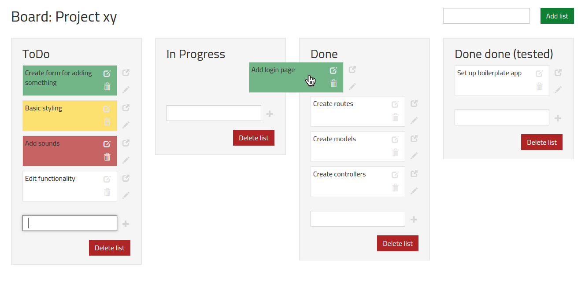
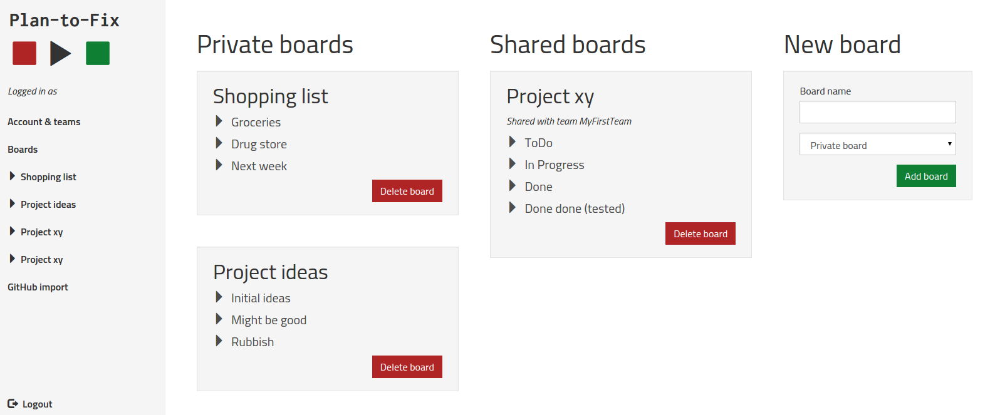
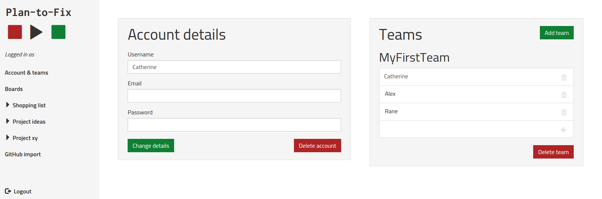
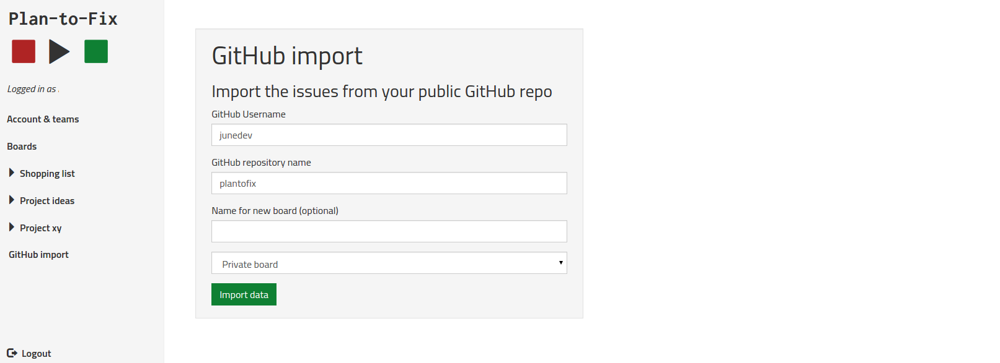
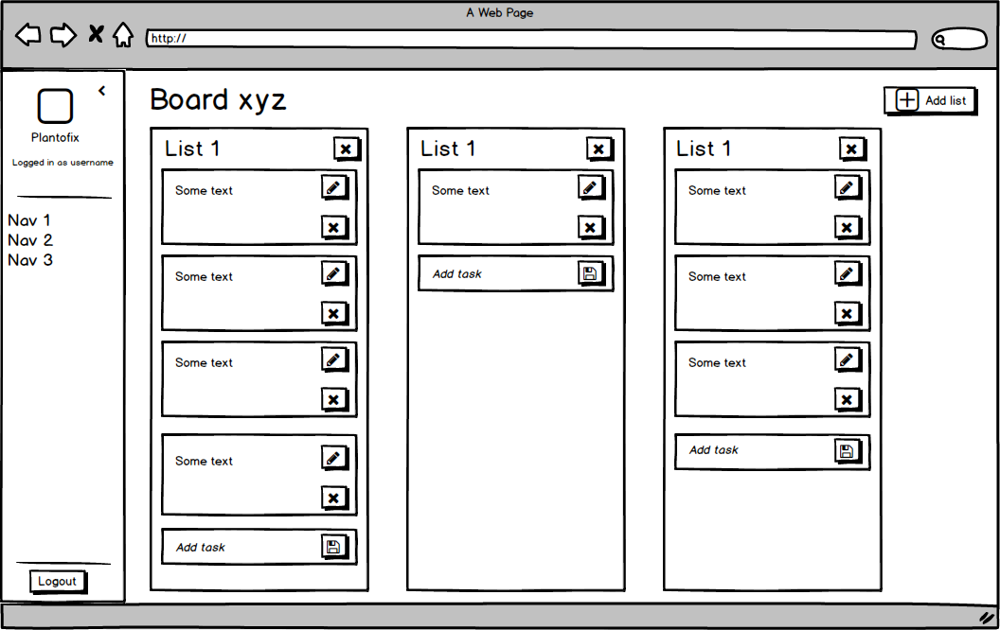

#Plan-to-Fix
<i>1-2 weeks project - started July 31, 2015</i>

https://plantofix.herokuapp.com



## Description
On the <a href="http://plantofix.herokuapp.com" target="_blanck">website</a> you can sign-up or log in to use the app. After you are logged in you can see all your boards with the lists they contain. Boards are seperated by private and shared boards.
Clicking on a board let's you see the lists with all the taks on it (see picture above).
Tasks can be sorted and moved between lists. They can be easily edited and if you want, you can even add extensive notes to a task.
A couple of preset colors from green to red can be choosen for the tasks to indicate importance or what you are allowed to do first.
If you want to add more than just a short task name you can open a modal to enter extensive notes for each task.



If you want to work together with other users on a board you can create teams of users and create a new board for this team. You can always delete or add team members later on.



As an additional gimmick, you can also import issues including their description and label color from any public GitHub repository.



## Inspiration
The original task was to build a Rails app with 2 or more RESTful resources. I was a bit tired of the usual exercise of having a user resource and then blog posts, pictures, videos or something similar associated with them. So I decided to do something a little different. I always liked the mechanics of <a href="https://trello.com/" target="_blanck">Trello</a> but I found it quite overloaded with features. So I did to do a planning tool on my own.

## Methods and Algorithms
### Real numbers to store positions
If the user drags a task to another position I have to store the new order of the the tasks in the database. Only that way the board still looks exactly the same after refreshing the page. I wanted a way to always get the correct order of all items without the need to update all tasks every time one task is moved. Usually the position would be an integer value but that does not do the trick. So I remembered my math training: 
> Between any two real numbers exists another real number.

So I make the position a float instead of an integer. Now if there is a task with position=1 and another one with position=2, a third task can be moved in between. The new position is calculated to be 1.5. That way by only updating the moved task the board can be rendered correctly on page refresh. Of course edge cases of only a task below existing but none above etc. have also be taken care of the in the calculation.

```javascript
function new_position($item){
  var pre = 0;
  var succ = 0;
  var current_pos = parseFloat($item.data().position);

  if($item.prev().length){
    pre=parseFloat($item.prev().data().position);
  }
  if($item.next().length){
    succ=parseFloat($item.next().data().position);
  }

  if(pre+succ === 0) return current_pos;
  if(pre === 0) return succ/2;
  if(succ === 0) return (pre + 1.0);
  return (parseFloat(pre) + parseFloat(succ))/2;
}
```

### Making due without client side templating
Since this project was supposed to be without any front-end framework I had no way for proper client side templating. This is not a problem if you just want to add a list item with some text but I wanted to add a new task with all the needed html (edit form, modal, etc.) without reloading the page. So I had to use a dirty trick. When sending the new task to the controller, I get the controller to render the respective partial with the correct data and send the resulting html back. The callback of my AJAX request can then just append this html to list and the new task looks exactly the same as with the freshly loaded page.

```javascript
$("body").on("submit", ".new_task_item",function(){
  var that = this;
  event.preventDefault();
  $.ajax({
    url: domain + "/tasks",
    type:"post",
    dataType: 'html',
    data: $(this).serialize()
  }).done(function(result){
    $(that).siblings("ul").append(result);
    $(that).find("input[name='task[name]']").val(null);
  });
});
```

## Front-end
### JavaScript code
To improve user experience creating and updating tasks is done by sending AJAX requests to the task controller. That way no page refresh is required when moving or editing a task, adding a new one and changing the color.
The AJAX request are done using the jQuery `$.ajax` function. <br>
The drag and drop functionality for the tasks is realized using <a href="https://jqueryui.com/sortable/" target="_blanck">jQuery UI Sortable</a>. It provides a lot useful options and triggers for callbacks. The option `connectWith` allows to specifiy other container elements that are allowed as drop area. This is done just by providing an appropriate jQuery selector. That way all the list on a board serve as drop area no matter which task is picked up. jQuery UI Sortable also allows to specify a callback function for `update` which is executed only if the position of an item has changed. Unfortunatly that functionality has a reported <a href="https://bugzilla.mozilla.org/show_bug.cgi?id=787944" target="_blanck">bug</a> in Firefox since forever. The only work-around I could find was to not use `update` but use `stop` as a trigger instead. I have to live with the fact that `updatePosition` is also called in the background when the user stops sorting but the position did not actually change.

```javascript
$(".sortable").sortable({
  connectWith: ".sortable",
  stop: updatePosition
});

function updatePosition(event, ui){
  var updateData = { 
    task: {
      list_id: ui.item.parent().data().id,
      position: new_position(ui.item)
    }
  }

  $.ajax({
    url: domain+'/tasks/'+ui.item.data().id,
    type:'put',
    dataType: 'json',
    contentType: 'application/json',
    data: JSON.stringify(updateData)
  })
}
```

### Markup
The markup is written with ERB. This comes in very handy combined with Rails ability of dealing with partials and collections. Imagine the SHOW page for a board (as shown at the beginning of this page). There is a lot going on but thanks to Rails this can be separated nicely. The board SHOW page actually only contains the markup for the board itself and an ERB tag that renders the list partial for all the list of that board. The list partial then again contains only the markup for the list and an ERB tag that renders the task partial for all the task in that list. Now the markup for board, list and task can be maintained separately.

```html
<!-- show.html.erb (excerpt) -->
<div class="row list-row">
  <%= render partial: "boards/list", collection: @board.lists %>
</div>

<!-- _list.html.erb (excerpt) -->
<h3><%= list.name %></h3>
<ul class="sortable list-unstyled" data-id="<%= list.id %>">
  <%= render partial: "boards/task", collection: list.sorted_tasks %>
</ul>
```

### Styling
Before starting with actual coding and styling, I did low fidelity wireframes to sort out which functionality will appear on which screen/ belongs to which partial. I used <a href="https://balsamiq.com/" target="_blanck">Balsamiq</a> although I was not entirely satisfied with the program itself.


The SASS version of <a href="#" target="_blanck">Bootstrap</a> is used as CSS framework for this project. That way, customization is very convenient when set up correctly in the first place. Variable overrides can be defined the `application.scss` file or a separate file that is then imported. Afterwards the Bootstrap SCSS files have to be imported and finally all the custom style files.
With Bootstrap's navbar and grid system (column number depending on screen-width etc.) the app is quite responsive but there are still a couple of screen sizes for which the styling needs to be improved.

```
$input-border-focus: #767171;
$font-family-base: 'Titillium Web', sans-serif;
$font-size-base: 16px;
$color-red: #AF2424;
$color-green: #0F8033;
$btn-primary-bg: $color-green;
$btn-danger-bg: $color-red;
$btn-primary-border: $color-green;
$btn-danger-border: $color-red;

@import "bootstrap-sprockets";
@import "bootstrap";

@import "general";
@import "landing_page";
@import "main_content";
@import "navigation_logo";
@import "custom_buttons";
```

## Back-end
### Framework
The back-end is standard Ruby on Rails with boards, lists, tasks, users and teams as RESTful resources.
The authentication is implemented by using only the BCrypt gem as no distinct roles where required in which case CanCanCan would make sense. To ensure authorized access only the controller actions are set up to check for the presense of a logging in user via a global `authenticate` method or even by checking ownership (see example below).

```ruby
def update
  @board = Board.find(params[:id])
  redirect_to root_path unless @board.users.include?(current_user)
  if @board.update(board_params)
    redirect_to board_path
  else
    redirect_to board_path, alert: 'Board could not be updated.'
  end
end
```

### Database
PostgreSQL is used as database. After setting up the right ActiveRecord helper methods accessing the data throughout the app becomes very simple. Also validations are included in all the model definitions. 

```ruby
class User < ActiveRecord::Base
  has_and_belongs_to_many :teams
  has_many :boards, through: :teams
  has_many :tasks, class_name: "Task", foreign_key: "assignee_id"
  
  has_secure_password

  validates :username, uniqueness: true, length: {in: 4..30}
  validates :password, length: {in: 4..30}
  validates :email, uniqueness: true, length: {in: 4..50}
  validates_format_of :email, :with => /\A[^@]+@([^@\.]+\.)+[^@\.]+\z/
end
```

## Miscellaneous
I made use of the <a href="https://github.com/peter-murach/github" target="_blanck">GitHub API gem</a> to provide an import feature. After entering a github username and the name of the reposititory the issue data is requested from GitHub. A new list is filled with the issues as tasks, label color is applied and the description is loaded into the notes of that task.

```ruby
def self.import(github_params)
  username = github_params["username"]
  repo = github_params["repo"]
  boardname = github_params["boardname"]
  team_id = github_params["team_id"]
  position = 1

  issues = Github::Client::Issues.new

  begin
    imported_data = issues.list(user: username, repo: repo, state: 'open')
  rescue
    return false
  else
    if imported_data.length > 0

      if Team.find(team_id)
        team = Team.find(team_id)
      else
        team = current_user.find_private_team
      end

      if boardname && boardname.length >= 1
        board = team.boards.create!(name:boardname)
      else
        board = team.boards.create!(name:repo)
      end

      list = board.lists.create!(name:"ToDo")
      board.lists.create!(name:"In progress")
      board.lists.create!(name:"Done")

      imported_data.each do |issue|
        list.tasks.create!(name: issue["title"], color: "white", 
        position: position += 1, description: issue["body"], 
        color: check_for_color(issue))
      end

      return board
    end
  end
end
```